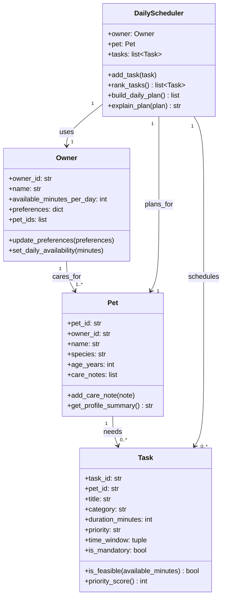

# PawPal+ Project Reflection

## 1. System Design

**a. Initial design**

My initial design centers on four classes: `Owner`, `Pet`, `Task`, and `DailyScheduler`.

Three core user actions the system is built to support are:

1. Add and manage pet profile details (name, species, age, and care preferences).
2. Add and prioritize care tasks (walks, feeding, medication, grooming, enrichment) with duration and optional time windows.
3. Generate and review today's care plan, including why tasks were selected and ordered.

Class responsibilities:

- `Owner`: Stores owner identity, daily time budget, and planning preferences.
- `Pet`: Stores pet details and pet-specific constraints (for example, medication rules or preferred walk times).
- `Task`: Represents a single care activity with duration, priority, category, and scheduling constraints.
- `DailyScheduler`: Applies constraints and priorities to choose and order tasks into a realistic daily plan.

Mermaid class diagram:

**b. Design changes**

Yes. After reviewing the class skeleton, I made two design updates to clarify relationships and avoid fragile scheduling logic later:

1. I renamed `CareTask` to `Task` to keep naming consistent between UML, code, and UI language.
2. I added explicit relationship fields in the skeleton: `Owner.pet_ids`, `Pet.owner_id`, and `Task.pet_id`.

These changes make object relationships direct instead of inferred. That reduces potential logic bottlenecks when scaling from one pet to multiple pets, because the scheduler can filter tasks by `pet_id` without expensive matching or assumptions based on task titles.

---

## 2. Scheduling Logic and Tradeoffs

**a. Constraints and priorities**

- What constraints does your scheduler consider (for example: time, priority, preferences)?
- How did you decide which constraints mattered most?

**b. Tradeoffs**

- Describe one tradeoff your scheduler makes.
- Why is that tradeoff reasonable for this scenario?

---

## 3. AI Collaboration

**a. How you used AI**

- How did you use AI tools during this project (for example: design brainstorming, debugging, refactoring)?
- What kinds of prompts or questions were most helpful?

**b. Judgment and verification**

- Describe one moment where you did not accept an AI suggestion as-is.
- How did you evaluate or verify what the AI suggested?

---

## 4. Testing and Verification

**a. What you tested**

- What behaviors did you test?
- Why were these tests important?

**b. Confidence**

- How confident are you that your scheduler works correctly?
- What edge cases would you test next if you had more time?

---

## 5. Reflection

**a. What went well**

- What part of this project are you most satisfied with?

**b. What you would improve**

- If you had another iteration, what would you improve or redesign?

**c. Key takeaway**

- What is one important thing you learned about designing systems or working with AI on this project?
