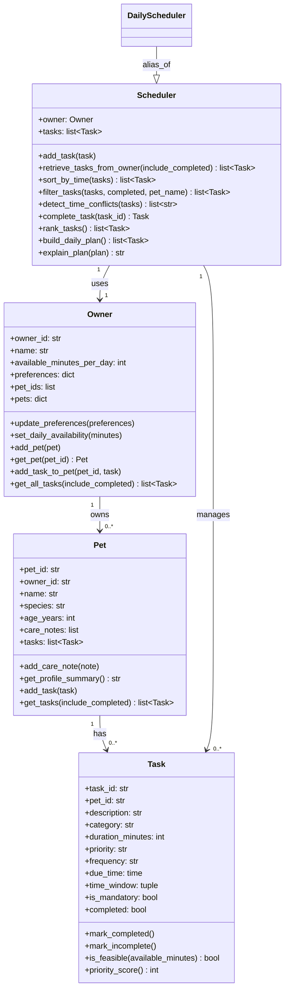

# PawPal+ Project Reflection

## 1. System Design

**a. Initial design**

My initial design centers on four classes: `Owner`, `Pet`, `Task`, and `DailyScheduler`.

Three core user actions the system is built to support are:

1. Add and manage pet profile details (name, species, age, and care preferences).
2. Add and prioritize care tasks (walks, feeding, medication, grooming, enrichment) with duration and optional time windows.
3. Generate and review today's care plan, including why tasks were selected and ordered.

Class responsibilities:

- `Owner`: Stores owner identity, daily time budget, and planning preferences.
- `Pet`: Stores pet details and pet-specific constraints (for example, medication rules or preferred walk times).
- `Task`: Represents a single care activity with duration, priority, category, and scheduling constraints.
- `DailyScheduler`: Applies constraints and priorities to choose and order tasks into a realistic daily plan.

Mermaid class diagram:

```mermaid
classDiagram
		class Owner {
			+owner_id: str
			+name: str
			+available_minutes_per_day: int
			+preferences: dict
			+pet_ids: list
			+pets: dict
			+update_preferences(preferences)
			+set_daily_availability(minutes)
			+add_pet(pet)
			+get_pet(pet_id) Pet
			+add_task_to_pet(pet_id, task)
			+get_all_tasks(include_completed) list~Task~
		}

		class Pet {
			+pet_id: str
			+owner_id: str
			+name: str
			+species: str
			+age_years: int
			+care_notes: list
			+tasks: list~Task~
			+add_care_note(note)
			+get_profile_summary() str
			+add_task(task)
			+get_tasks(include_completed) list~Task~
		}

		class Task {
			+task_id: str
			+pet_id: str
			+description: str
			+category: str
			+duration_minutes: int
			+priority: str
			+frequency: str
			+due_time: time
			+time_window: tuple
			+is_mandatory: bool
			+completed: bool
			+mark_completed()
			+mark_incomplete()
			+is_feasible(available_minutes) bool
			+priority_score() int
		}

		class Scheduler {
			+owner: Owner
			+tasks: list~Task~
			+add_task(task)
			+retrieve_tasks_from_owner(include_completed) list~Task~
			+sort_by_time(tasks) list~Task~
			+filter_tasks(tasks, completed, pet_name) list~Task~
			+detect_time_conflicts(tasks) list~str~
			+complete_task(task_id) Task
			+rank_tasks() list~Task~
			+build_daily_plan() list~Task~
			+explain_plan(plan) str
		}

		class DailyScheduler {
		}

		DailyScheduler --|> Scheduler : alias_of
		Owner "1" --> "0..*" Pet : owns
		Pet "1" --> "0..*" Task : has
		Scheduler "1" --> "1" Owner : uses
		Scheduler "1" --> "0..*" Task : manages
```

**b. Design changes**

Yes. After reviewing the class skeleton, I made two design updates to clarify relationships and avoid fragile scheduling logic later:

1. I renamed `CareTask` to `Task` to keep naming consistent between UML, code, and UI language.
2. I added explicit relationship fields in the skeleton: `Owner.pet_ids`, `Pet.owner_id`, and `Task.pet_id`.

These changes make object relationships direct instead of inferred. That reduces potential logic bottlenecks when scaling from one pet to multiple pets, because the scheduler can filter tasks by `pet_id` without expensive matching or assumptions based on task titles.

---

## 2. Scheduling Logic and Tradeoffs

**a. Constraints and priorities**

My scheduler currently considers these constraints:

- Owner daily time budget (`available_minutes_per_day`)
- Task duration (`duration_minutes`)
- Mandatory vs optional tasks (`is_mandatory`)
- Priority level (`high`, `medium`, `low`)
- Due-time ordering (`due_time`) and deterministic tie-breaks
- Completion status (`completed`) so finished tasks are not re-planned

I prioritized constraints in this order: feasibility first (can it fit in available time), then urgency/importance, then ordering for usability. In practice, `rank_tasks()` sorts by mandatory status, then priority score, then due time, and `build_daily_plan()` greedily picks tasks that still fit remaining minutes. This gave a predictable planning behavior that was easy to test and explain.

**b. Tradeoffs**

- One tradeoff in my scheduler is that conflict detection only checks exact matching due times (for example, two tasks at 09:00), not interval overlap based on duration.
- Another tradeoff is recurrence scope. I implemented daily recurrence on completion (`complete_task`) because that delivered clear user value quickly, while avoiding a larger date-engine redesign.
- These tradeoffs were reasonable for this project stage because they kept the code understandable, deterministic, and testable while still covering the most meaningful user outcomes.

---

## 3. AI Collaboration

**a. How you used AI**

I used VS Code Copilot as a design assistant and implementation accelerator, but kept architecture decisions human-led.

Most effective Copilot features for this scheduler were:

- Chat in Ask mode for targeted design checks (for example: edge cases for sorting/conflicts/recurrence).
- In-editor code generation for fast drafting of tests and repetitive setup blocks.
- Follow-up refinement prompts to tighten method responsibilities and keep tests behavior-focused.

The most helpful prompts were specific and constraint-based, such as requesting edge cases tied to actual classes and asking for tests that validate deterministic ordering and time conflicts.

**b. Judgment and verification**

One suggestion I rejected as-is was introducing broader recurrence logic (beyond daily completion) too early. I modified the approach to only create the next task when a daily task is completed, because that matched current data fields and avoided speculative complexity.

I verified AI suggestions by checking class boundaries in `pawpal_system.py`, confirming behavior with pytest, and only keeping changes that improved clarity and passed tests. If a suggestion made relationships blurrier or methods do too much, I simplified it before accepting.

---

## 4. Testing and Verification

**a. What you tested**

I tested:

- Task completion state changes (`mark_completed`, `mark_incomplete`)
- Task-to-pet validation (`pet_id` consistency)
- Owner aggregation of tasks across pets
- Scheduler plan generation under time constraints
- Chronological sorting correctness
- Duplicate-time conflict detection
- Daily recurrence behavior after task completion

These tests were important because they validate both happy paths and the edge cases most likely to affect real user trust in a planner: incorrect ordering, missing warnings, and recurrence mistakes.

**b. Confidence**

Confidence level: 5/5 for the current project scope.

The suite is currently fully passing (`12 passed`) and covers core planning behaviors plus key edge cases.

If I had more time, I would add tests for:

- Interval-based conflict overlap (not just exact same-time collisions)
- Recurrence across calendar dates/time zones
- Input validation hardening for malformed due-time formats
- Larger multi-pet workloads to evaluate deterministic behavior at scale

---

## 5. Reflection

**a. What went well**

I am most satisfied with how the final design stayed clean while still expanding features. The `Owner` -> `Pet` -> `Task` model remained explicit, and `Scheduler` became the single orchestration point for planning, sorting, filtering, conflicts, and recurrence completion.

**b. What you would improve**

In another iteration, I would add real date-aware recurrence and interval scheduling, then separate planning strategy into smaller policy objects (for example, ranking policy vs conflict policy) for easier extensibility.

**c. Key takeaway**

The biggest takeaway is that using AI effectively means acting as the lead architect, not a passive acceptor of suggestions. Copilot produced useful drafts quickly, but system quality came from deliberate constraint choices, test-driven verification, and phased chat sessions.

Using separate chat sessions by phase helped organization significantly:

- Phase 1: UML and relationships
- Phase 2: implementation and scheduler logic
- Phase 3: test expansion and verification
- Phase 4: UI integration and documentation

That separation reduced context mixing, made decisions easier to audit, and helped preserve design intent from planning through final polish.
